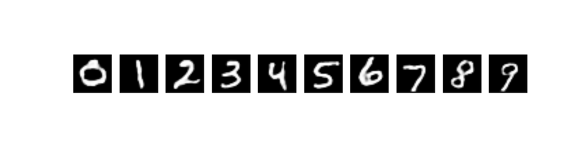

# Compact-DiT

The code is just a minor update of the Dit code by meta [https://github.com/facebookresearch/DiT](https://github.com/facebookresearch/DiT)

## Updates:
1.  Simplified the training code and model to work with simpler imageset and low compute hardware.

## How to train:
1. Train the Autoencoder by running [autoencoder_train.py](https://github.com/saksham18kukreja/Compact-DiT/blob/main/autoencoder_train.py)

The original code uses variational auto encoder to include stochasticity in the latent space output, removing this for faster training.

2. Train the Diffusion transfomer [train.py](https://github.com/saksham18kukreja/Compact-DiT/blob/main/train.py)

Change the dataloader for your custom dataset in both autoencoder.py and train.py

3. Sample output images after training using [sample.py](https://github.com/saksham18kukreja/Compact-DiT/blob/main/sample.py)

## Results 
Training and sampling on MNIST dataset

